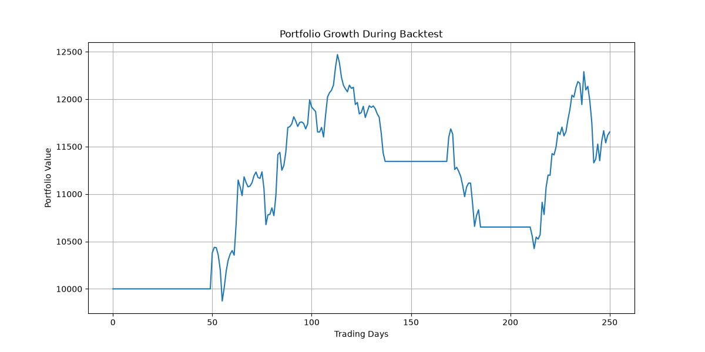
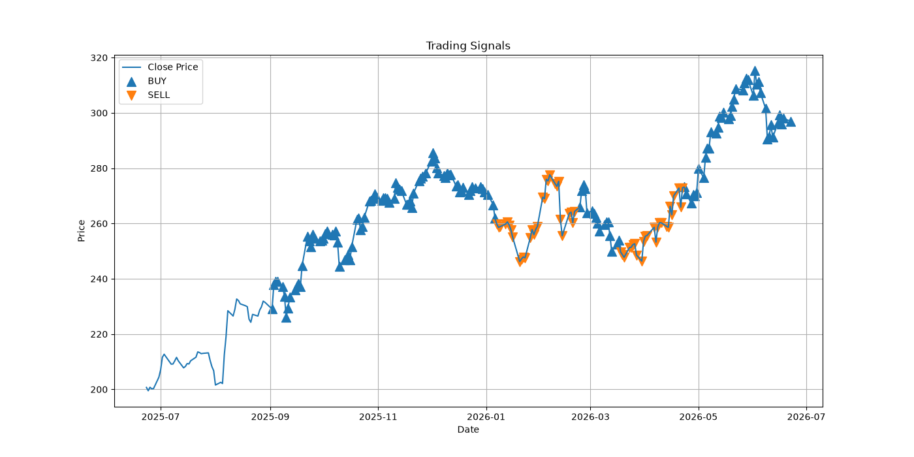

# 📈 Quantitative Stock Intelligence Platform (In Development)

**A modular Python framework for quantitative stock analysis, algorithmic signal generation, and strategy backtesting.**


---

## 🧠 Overview

The Quantitative Stock Intelligence Platform is a Python-based quantitative finance project designed to analyze historical market data, generate trading signals, evaluate strategy performance, and visualize portfolio growth.

This project is being built incrementally to simulate how real quantitative trading systems are developed.

---

## 🚧 Current Development Status

### Completed ✅

* Historical stock data retrieval using Yahoo Finance
* SMA (20 & 50)
* RSI
* MACD
* Trading signal generation
* Portfolio backtesting engine
* Sharpe Ratio calculation
* Maximum Drawdown analysis
* Win Rate analysis
* Equity Curve visualization
* Buy/Sell Signal visualization

### Currently Building 🔄

* Streamlit Dashboard
* Portfolio Analytics
* Multi-Stock Analysis

### Planned Features 📌

* Machine Learning Forecasting
* Portfolio Optimization
* Real-Time Market Monitoring
* Cloud Deployment

---

## ⚙️ Implemented Features

### Market Data

* Historical stock data retrieval using Yahoo Finance
* Data preprocessing and cleaning

### Technical Indicators

* SMA 20
* SMA 50
* RSI
* MACD
* MACD Signal Line

### Trading Signal Engine

* Buy signal generation
* Sell signal generation
* Rule-based strategy framework

### Backtesting Engine

* Capital tracking
* Trade simulation
* Portfolio performance evaluation

### Risk Analytics

* Sharpe Ratio
* Maximum Drawdown
* Win Rate

### Visualizations

* Equity Curve
* Buy/Sell Signal Chart

---

## 🏗️ Architecture

┌──────────────────────────────────────────────────┐
│            Yahoo Finance (yfinance)               │
│         Historical OHLCV Market Data              │
└──────────────────────┬───────────────────────────┘
                       │
                       ▼
┌──────────────────────────────────────────────────┐
│                  data_loader.py                   │
│          Fetch · Clean · Normalize                │
└──────────────────────┬───────────────────────────┘
                       │
                       ▼
┌──────────────────────────────────────────────────┐
│                  indicators.py                    │
│         SMA-20 · SMA-50 · RSI · MACD             │
└──────────────────────┬───────────────────────────┘
                       │
                       ▼
┌──────────────────────────────────────────────────┐
│                   signals.py                      │
│           BUY / SELL Signal Detection             │
└──────────────────────┬───────────────────────────┘
                       │
                       ▼
┌──────────────────────────────────────────────────┐
│                  backtester.py                    │
│       Capital Tracking · Trade Simulation         │
└──────────────────────┬───────────────────────────┘
                       │
              ┌────────┴────────┐
              ▼                 ▼
   ┌───────────────┐   ┌─────────────────────┐
   │    risk.py    │   │  equity_curve.py     │
   │ Sharpe · MDD  │   │  signal_chart.py     │
   │  · Win Rate   │   │   Visualizations     │
   └───────────────┘   └─────────────────────┘

---

## 📊 Backtest Results

Backtested on AAPL with an initial capital of $10,000.

| Metric           | Value      |
| ---------------- | ---------- |
| Initial Capital  | $10,000    |
| Final Capital    | $11,645.72 |
| Total Return     | 16.46%     |
| Number of Trades | 5          |
| Sharpe Ratio     | 0.90       |
| Max Drawdown     | -16.40%    |
| Win Rate         | 50%        |

---

## 📷 Visualizations

### Equity Curve



### Buy/Sell Signal Chart



---

## 🛠️ Tech Stack

### Programming

* Python

### Data Analysis

* Pandas
* NumPy

### Financial Data

* yFinance

### Visualization

* Matplotlib

### Development Tools

* Git
* GitHub
* Ubuntu (WSL)

---

## 🚀 Installation

```bash
git clone https://github.com/adityag1507/quantitative-stock-intelligence-platform.git

cd quantitative-stock-intelligence-platform
```

Create and activate a virtual environment:

```bash
python -m venv venv

source venv/bin/activate
```

Install dependencies:

```bash
pip install -r requirements.txt
```

---

## 🚀 Usage

Run the backtesting workflow:

```bash
python test_backtester.py
```

Generate equity curve:

```bash
python equity_curve.py
```

Generate buy/sell signal chart:

```bash
python signal_chart.py
```

---

## 📁 Project Structure

```text
quantitative-stock-intelligence-platform/

├── data_loader.py
├── indicators.py
├── signals.py
├── backtester.py
├── equity_curve.py
├── signal_chart.py

├── test_backtester.py
├── test_indicators.py
├── test_signals.py
├── test_risk.py

├── quant_engine/
│   ├── indicators/
│   ├── backtesting/
│   ├── risk/
│   └── ml_models/

├── equity_curve.png
├── buy_sell_signals.png

└── README.md
```

---

## 🎯 Skills Demonstrated

* Python Development
* Data Analysis
* Quantitative Finance
* Technical Analysis
* Algorithmic Trading
* Backtesting
* Risk Analytics
* Financial Data Processing
* Data Visualization
* Git & GitHub

---

## 🗺️ Roadmap

* [x] Market Data Pipeline
* [x] Technical Indicators
* [x] Trading Signals
* [x] Backtesting Engine
* [x] Risk Analytics
* [x] Visualizations
* [ ] Streamlit Dashboard
* [ ] Portfolio Analytics
* [ ] Multi-Stock Support
* [ ] Machine Learning Forecasting
* [ ] Cloud Deployment

---

## 👨‍💻 Author

**Aditya Goyal**

Computer Engineering Student | Quantitative Finance | AI & Data Science

GitHub: https://github.com/adityag1507

---

⭐ If you found this project interesting, consider starring the repository.
